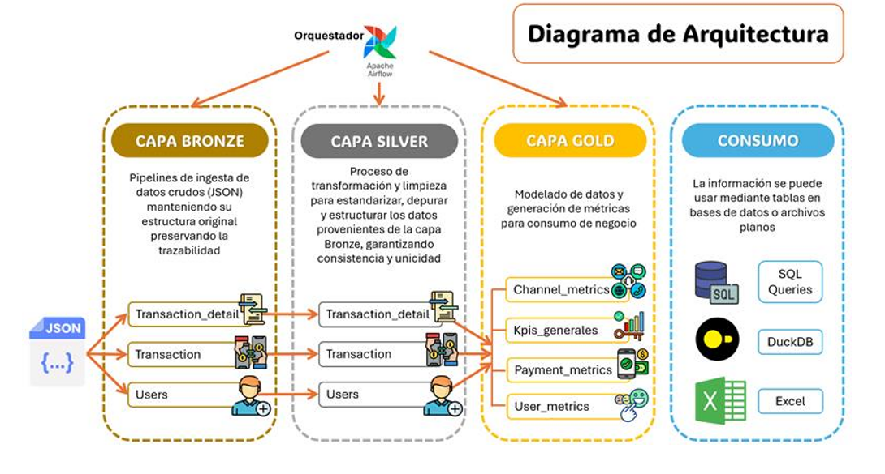
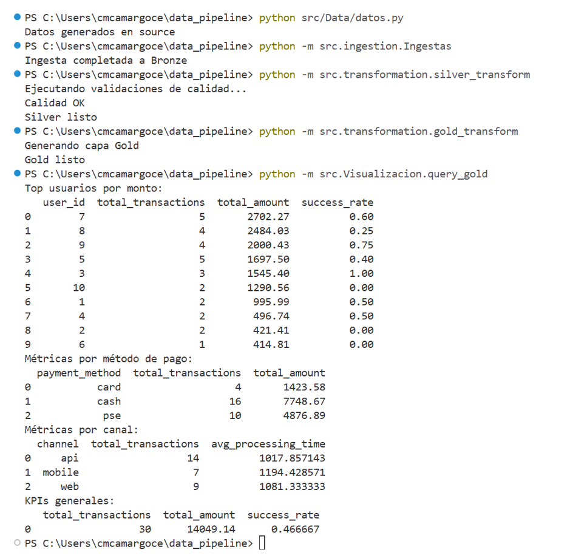
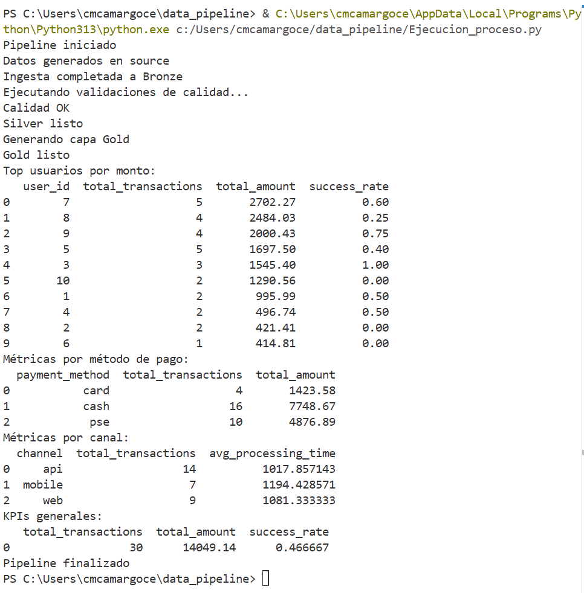

# Data Pipeline Tipo Medallion - Bronze → Silver → Gold

Este proyecto implementa un **pipeline de datos** que centraliza, transforma y expone información de transacciones financieras usando Python y buenas prácticas de ingeniería de datos.  
Se incluyen **capas Bronze, Silver y Gold**, con validaciones de calidad y trazabilidad completa.

## Requisitos

- Python 3.10+  
- Instalar las dependencias (librerias)
- Configurar las variables de entorno
  
## Descripcion del pipeline
El pipeline procesa datos transaccionales siguiendo un modelo tipo Medallion (Bronze → Silver → Gold):

#### 1. Ingesta de datos: 
Los datos provienen de archivos JSON o CSV, generados aleatoriamente mediante funciones de Python para cumplir con la estructura de las tres tablas principales (users, transactions, transaction_details).
#### 2. Capa Bronze:
Los datos se almacenan en su forma cruda, sin modificaciones ni limpieza. Esta capa permite mantener un registro íntegro de la información original para trazabilidad.
#### 3. Capa Silver:
Se aplican limpieza, validación de esquema y reglas de negocio, eliminando duplicados y asegurando la integridad referencial. Los datos se guardan en formato Parquet, optimizado para análisis y consultas eficientes.
#### 4. Capa Gold:
Se calculan métricas agregadas y KPIs, listas para análisis y visualización. Los resultados se pueden consultar mediante SQL usando DuckDB, permitiendo extraer información útil para la toma de decisiones.
#### 5. Automatización y orquestación:
Todo el flujo puede automatizarse mediante un DAG estilo Airflow, ejecutando cada paso en secuencia. En caso de errores, se pueden generar alertas específicas para identificar rápidamente el paso afectado.

## Ejecución
- Creación de datos muestra - COMANDO - python src/Data/datos.py
- Ejecutar la ingesta de datos (Bronze) - COMANDO: python -m src.ingestion.Ingestas
- Transformar datos (silver) y calidad, dentro del modulo de silver se encuentra integrado las validaciones de calidad - COMANDO: python -m src.transformation.silver_transform
- Ejecucion Calidad - COMANDO: python -m src.calidad.validacion_calidad
- Generar metricas (Gold) - COMANDO: python -m src.transformation.gold_transform
- Visualizar datos (resumen de Kpis) - COMANDO: python -m src.Visualizacion.query_gold

### Ejecucion total
- Se diseña la ejecucion para que sea similar a un DAG en airflow indicando el flujo que se debe seguir paso a paso para que se ejecute correctamente. Comando - c:/Users/cmcamargoce/data_pipeline/Ejecucion_proceso.py 

## Notas importantes:
- Cada capa genera datos en su respectiva carpeta:
- data/bronze/ → datos crudos
- data/silver/ → datos limpios, transformados y con validaciones de calidad
- data/gold/ → métricas y resultados finales
- Gold se puede consultar con DuckDB o exportar a SQL/Excel.
- Los datos incluidos son de ejemplo; para probar con datos reales reemplaza los archivos en data/source/.

## Arquitectura Propuesta:

- Bronze: capa de ingesta, datos crudos sin procesar.
- Silver: datos limpios, sin duplicados, reglas de negocio aplicadas.
- Gold: métricas agregadas, KPIs y tablas listas para análisis.
- Consumo: los usuarios pueden consultar las métricas con SQL, DuckDB, etc.

## Decisiones técnicas
- Python + Pandas: para ingesta, transformación y limpieza de datos, suficiente para datasets medianos.
- Generación de datos aleatorios con las caracteristicas solicitadas (campos).
- DuckDB: motor SQL embebido, ideal para exponer Gold de forma rápida y ligera.
- JSON → Parquet:
  Guardar Bronze en JSON crudo (fácil de inspeccionar).
  Silver y Gold en Parquet (eficiente, columnar y comprimido).
- Modularidad:
   src/ingestion/ → scripts de carga de informacion
   src/transformation/ → scripts Silver/Gold
   src/calidad/ → validaciones 
- Variables de entorno: rutas configurables para Bronze/Silver/Gold (.env).
- Trazabilidad completa: desde Bronze → Silver → Gold, sin pérdida de datos.
- Validaciones de calidad: null checks, duplicados, integridad referencial.

## Anexos
- Se incluyen las capturas/logs del flujo del proceso tanto paso a paso como la ejecucion (Dags)
 #### Paso a Paso:
  
#### Ejecución Total:
  
